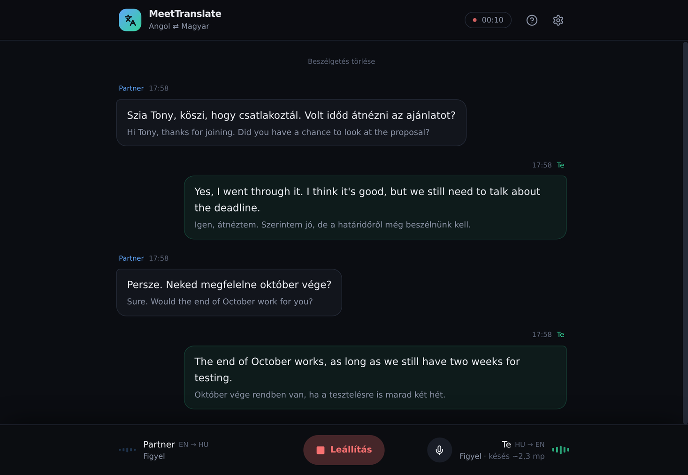
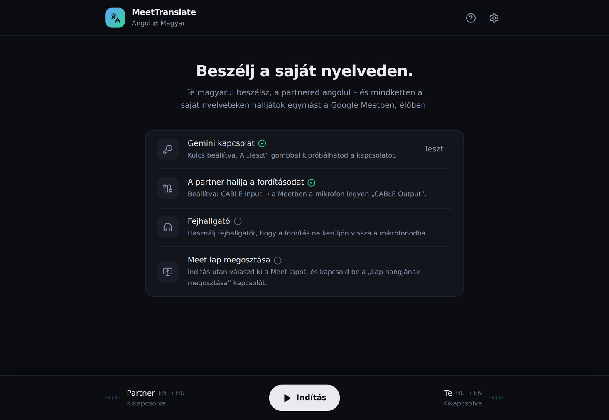
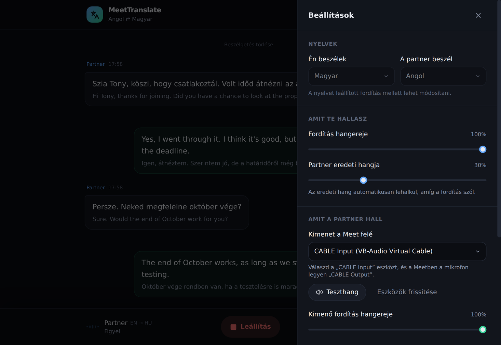

# MeetTranslate Studio

**Kétirányú, élő hangfordító Google Meethez.** Te magyarul beszélsz, a partnered angolul – és mindketten a saját nyelveteken halljátok egymást, hangban, néhány másodperces késéssel. A fordítást a Google **Gemini 3.5 Live Translate** modellje végzi.



## Tartalom

- [Mit tud?](#mit-tud)
- [Hogyan működik?](#hogyan-működik)
- [Amire szükséged lesz](#amire-szükséged-lesz)
- [Telepítés (Windows 11)](#telepítés-windows-11)
- [Egyszeri hangbeállítás](#egyszeri-hangbeállítás)
- [Használat](#használat)
- [Beállítások](#beállítások)
- [Költségek](#költségek)
- [Adatvédelem](#adatvédelem)
- [Hibaelhárítás](#hibaelhárítás)
- [Fejlesztőknek](#fejlesztőknek)
- [Licenc](#licenc)

## Mit tud?

- **Mindkét irányban fordít, egyszerre:** a partner angolját magyarul hallod, a te magyarodat ő angolul hallja a Meetben.
- **Folyamatosan fordít**, nem várja meg a mondat végét. A késés kb. 2–3 másodperc, nagyjából annyi, amennyivel egy szinkrontolmács jár a beszélő mögött.
- **Megtartja a hangszínt:** a fordított hang a beszélő hangszínét és tempóját is igyekszik visszaadni.
- **Behozza a lemaradást:** ha a fordítás lemarad, rövidebbre vágja a szüneteket, és kicsit gyorsabban beszél.
- **Élő felirat:** a fordítás és az eredeti szöveg is megjelenik a képernyőn, szóról szóra.
- **Egyszerű a kezelése:** egy Indítás gomb, önellenőrző kezdőképernyő, és a VB-CABLE kimenetet magától kiválasztja.
- **Több mint 20 nyelv közül választhatsz** a felületen (a modell 70+ nyelvet ismer), alapból magyar ⇄ angol.
- **Biztonságos:** az API kulcs csak a saját gépeden van, és a program nem ment semmit.

| Kezdőképernyő | Beállítások |
|---|---|
|  |  |

*A képernyőképek bemutató szöveggel készültek.*

## Hogyan működik?

```
Partner (Meet lap hangja) ──► Gemini (cél: magyar) ──► a te fejhallgatód
Te (mikrofon)             ──► Gemini (cél: angol)  ──► VB-CABLE ──► Meet mikrofon ──► partner
```

A program egy kis helyi szerver (Python) és egy weboldal (Chrome). A szerver tartja a kapcsolatot a Geminivel, a böngésző pedig rögzíti és lejátssza a hangot. A partner felé menő fordítást a **VB-CABLE** nevű ingyenes „virtuális kábel” juttatja be a Meetbe, mintha az lenne a mikrofonod.

## Amire szükséged lesz

- **Windows 10 vagy 11** és **Google Chrome**
- **Python 3.10 vagy újabb:** <https://www.python.org/downloads/> (a telepítőben pipáld be: *Add python.exe to PATH*)
- **Gemini API kulcs:** <https://aistudio.google.com/apikey>
- **VB-Audio Virtual Cable (ingyenes):** <https://vb-audio.com/Cable/>
- **Fejhallgató**

## Telepítés (Windows 11)

1. Töltsd le a projektet: a zöld **Code → Download ZIP** gomb, majd csomagold ki (vagy `git clone`).
2. Kattints duplán a **`start.bat`** fájlra.
3. Az első indításkor megnyílik a `backend\.env` fájl a Jegyzettömbben. Írd be a kulcsodat:
   ```
   GEMINI_API_KEY=ide_jon_a_kulcsod
   ```
   Mentsd el, és indítsd újra a `start.bat`-ot.
4. A program magától feltelepíti, amire szüksége van (ez az első alkalommal 1–2 perc), és megnyitja a Chrome-ot a **http://localhost:8000** címen.
5. A kezdőképernyőn nyomd meg a **Teszt** gombot a „Gemini kapcsolat” sorban.

A `start.bat` ablaka maradjon nyitva a hívás alatt; ha bezárod, leáll a fordító.

## Egyszeri hangbeállítás

Erre azért van szükség, hogy a partner is hallja a fordításodat.

1. Telepítsd a **VB-CABLE**-t rendszergazdaként, majd indítsd újra a gépet.
2. A **Google Meetben:** Beállítások → Hang → **Mikrofon → „CABLE Output (VB-Audio Virtual Cable)”**.
3. A Windows alapértelmezett hangszórója maradjon a **fejhallgatód**, ne a CABLE.

A programban a partner felé menő kimenetet (CABLE Input) nem kell kézzel beállítani, az első indításkor magától kiválasztja. A **Beállítások → Teszthang** gombbal ellenőrizheted: ha közben mozog a Meet mikrofon-ikonja, minden rendben.

## Használat

1. Lépj be a Meet-hívásba egy Chrome-lapon.
2. A MeetTranslate-ben nyomd meg az **Indítás** gombot, és engedélyezd a mikrofont.
3. A felugró ablakban válaszd a **Chrome-lap** fület, jelöld ki a **Meet lapot**, és kapcsold be a **„Lap hangjának megosztása”** kapcsolót.
4. Kezdhetitek a beszélgetést.

Tippek:

- Húzd ki a MeetTranslate fülét **külön ablakba**, és tedd a Meet mellé: így a feliratot is látod.
- A **M** billentyűvel némíthatod a mikrofonodat (ilyenkor nem megy fordítás a partnernek).
- A buborékok fölé húzva az egeret a fordítást **újrajátszhatod** vagy **másolhatod**.
- Az alsó sávban látod, hogy mindkét irány épp mit csinál (*Figyel / Fordít / Beszél*), és kb. mennyi a **késés**.

## Beállítások

A fogaskerék ikonnal nyílik.

| Beállítás | Mire jó |
|---|---|
| **Nyelvek** | Milyen nyelven beszélsz te, és milyenen a partner (leállított fordítás mellett módosítható). |
| **Fordítás hangereje** | Milyen hangosan hallod a partner lefordított szavait. |
| **Partner eredeti hangja** | Az eredeti hang hangereje. Amíg a fordítás szól, magától lehalkul. |
| **Kimenet a Meet felé** | Ide megy a te lefordított hangod. Ez a *CABLE Input* legyen. |
| **Lemaradás automatikus behozása** | Hosszabb monológnál rövidíti a szüneteket, és kicsit gyorsít, hogy a fordítás ne csússzon el. |
| **A partner nyelvén mondott mondataimat is továbbítsa** | Ha néha angolul szólsz, azt is kimondja a partnernek. |
| **Gemini kapcsolat tesztelése** | Ellenőrzi, hogy működik-e a kulcs. |

## Költségek

A program ingyenes, a Gemini használatáért viszont a Google számláz (a kulcsodhoz tartozó projektben). Tájékoztató árak (2026. szeptember):

- bejövő hang: kb. **0,005 USD/perc** irányonként (ez a hívás alatt folyamatosan megy);
- kimenő fordított hang: kb. **0,03 USD/perc** (csak amikor valaki beszél).

Egy átlagos kétirányú beszélgetés így kb. **2–4 USD óránként**. Az ingyenes szint kipróbálásra elég, rendszeres használathoz kapcsold be a számlázást az AI Studióban. Az aktuális árakat itt találod: <https://ai.google.dev/gemini-api/docs/pricing>

## Adatvédelem

- Az API kulcs csak a `backend\.env` fájlban van, a böngészőbe nem kerül ki. **Ezt a fájlt soha ne oszd meg, és ne töltsd fel sehova** (a `.gitignore` ezért ki is zárja).
- A hang közvetlenül a Google Gemini API-hoz megy fordításra. A Google adatkezelése a kulcsodhoz tartozó szintre vonatkozó feltételek szerint történik (ingyenes szinten a Google az adatokat a szolgáltatás fejlesztésére is felhasználhatja).
- A program **nem ment** hangot vagy átiratot, és nincs benne analitika.
- Illik szólni a partnernek, hogy gépi tolmács segíti a beszélgetést.

## Hibaelhárítás

| Jelenség | Megoldás |
|---|---|
| „A helyi szerver nem fut” | Indítsd el a `start.bat`-ot, és hagyd nyitva az ablakát. |
| „Hiányzik az API kulcs” | `backend\.env` → `GEMINI_API_KEY=...`, majd indítsd újra a `start.bat`-ot. |
| „A kulcs érvénytelen / a modell nem érhető el” | Kérj új kulcsot az AI Studióban. Ellenőrizd, hogy elérhető-e a `gemini-3.5-live-translate-preview` modell. |
| „Nem érkezett hang a lapról” | Megosztáskor a *Chrome-lap* fület válaszd, és kapcsold be a *Lap hangjának megosztása* kapcsolót. |
| A partner nem hall semmit | A Meetben a mikrofon a *CABLE Output* legyen, a programban a kimenet a *CABLE Input*. Próbáld ki a Teszthangot. |
| A partner szaggatottan hall | Kapcsold ki a Meet zajszűrését (Beállítások → Hang). |
| Visszhang, vagy a fordítás saját magát fordítja | Használj fejhallgatót. A Windows alapértelmezett hangszórója ne a CABLE legyen. |
| Néha „Újrakapcsolódás…” | Ez normális: a Gemini kb. 10 percenként bontja a kapcsolatot, a program pedig egy szünetben észrevétlenül újat nyit. |
| A 8000-es port foglalt | Írd a `backend\.env` fájlba: `PORT=8010`, és nyisd meg a `http://localhost:8010` címet. |

## Fejlesztőknek

```
start.bat                      Windows indító (venv, csomagok, szerver, Chrome)
backend/
  server.py                    FastAPI: felület kiszolgálása, /api/health, /api/check, /ws/translate
  gemini_bridge.py             Böngésző ⇄ Gemini Live Translate híd (munkamenet-váltás, pufferelés, újrakapcsolódás)
  tests/                       Offline tesztek szimulált Geminivel
frontend/
  src/lib/audio.js             16 kHz PCM rögzítés (AudioWorklet), 24 kHz lejátszás, lemaradás-behozás, laphang-monitor
  src/lib/api.js               WebSocket csatorna a helyi szerverhez
  src/lib/latency.js           Késésmérő
  src/pages/TranslatorStudio.jsx   A két csatorna vezérlése
  src/components/              Felület (fejléc, beszélgetés, alsó sáv, beállítások, súgó)
  build/                       Lefordított felület (a tárolóban van, így a felhasználónak nem kell Node.js)
```

- **Tesztek:** `cd backend` → `.venv\Scripts\python -m pytest`
- **Felület fordítása** (Node.js 18+ kell): `cd frontend` → `npm install` → `npm run build`
- **Élő fejlesztés:** a `start.bat` futása mellett:
  ```
  cd frontend
  set REACT_APP_BACKEND_URL=http://localhost:8000
  npm start
  ```
- **Modell cseréje:** `backend\.env` → `GEMINI_MODEL=...`

Hozzájárulás előtt olvasd el a [CONTRIBUTING.md](CONTRIBUTING.md) fájlt. A változások listája: [CHANGELOG.md](CHANGELOG.md).

## Licenc

[MIT](LICENSE): szabadon használhatod, módosíthatod és terjesztheted, a szerzői jogi megjegyzés megtartásával. A szoftver „ahogy van” alapon érhető el, garancia nélkül.

A „Google Meet” és a „Gemini” a Google LLC védjegyei, a „VB-CABLE” a VB-Audio Software terméke. Ez a projekt független tőlük, és nem áll kapcsolatban velük.
